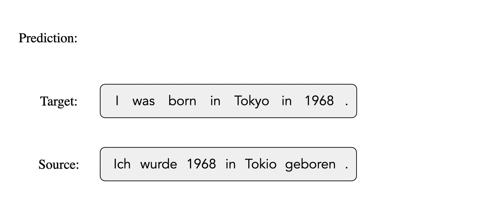
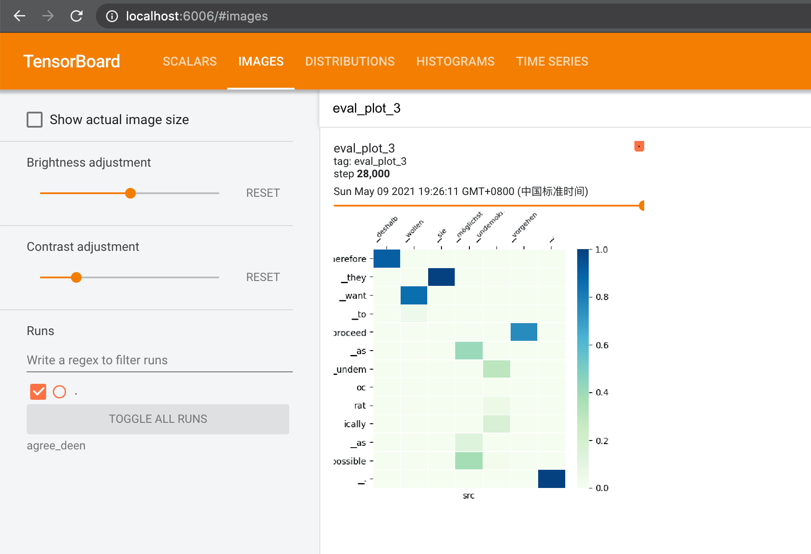
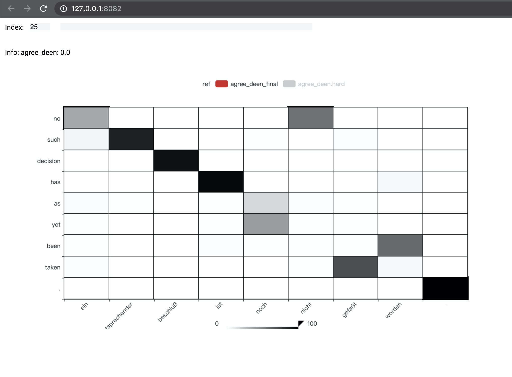

# Mask-Align: Self-Supervised Neural Word Alignment

This is the implementation of our work <a href="https://arxiv.org/abs/2012.07162">Mask-Align: Self-Supervised Neural Word Alignment</a>. 

```bibtex
@inproceedings{chen2021maskalign,
   title={Mask-Align: Self-Supervised Neural Word Alignment},
   author={Chi Chen and Maosong Sun and Yang Liu},
   booktitle={Association for Computational Linguistics (ACL)},
   year={2021}
}
```

The implementation is built on top of [THUMT](https://github.com/THUNLP-MT/THUMT).

## Contents 
* [Introduction](#introduction)
* [Prerequisites](#prerequisites)
* [Usage](#usage)
* [Configs](#configs)
* [Visualization](#visualization)
* [Contact](#contact)

## Introduction

**Mask-Align** is a self-supervised neural word aligner.
It parallelly masks out each target token and predicts it conditioned on both source and the remaining target tokens. The source token that contributes most to recovering a masked target token will be aligned to that target token.




## Prerequisites

* PyTorch
* NLTK
* remi *
* pyecharts *
* pandas *
* matplotlib *
* seaborn *

\*: *optional*, only used for [Visualization](#visualization).

## Usage

### Data Preparation

To get the data used in our paper, you can follow the instructions in [https://github.com/lilt/alignment-scripts](https://github.com/lilt/alignment-scripts).

To train an aligner with your own data, you should pre-process it yourself. Usually this includes tokenization, BPE, etc. You can find a simple guide [here](https://github.com/THUNLP-MT/THUMT/blob/master/docs/walkthrough.md#data-preparation). 

Now we have the pre-processed parallel training data (`train.src`, `train.tgt`), validation data (optional) (`valid.src`, `valid.tgt`) and test data (`test.src`, `test.tgt`). An example 3-sentence German–English parallel training corpus is:

```
# train.src
wiederaufnahme der sitzungsperiode
frau präsidentin , zur geschäfts @@ordnung .
ich bitte sie , sich zu einer schweigeminute zu erheben .

# train.tgt
resumption of the session
madam president , on a point of order .
please rise , then , for this minute ' s silence .
```

The next step is to shuffle the training set, which proves to be helpful for improving the results.

```python
python thualign/scripts/shuffle_corpus.py --corpus train.src train.tgt
```

The resulting files `train.src.shuf` and `train.tgt.shuf` rearrange the sentence pairs randomly.

Then we need to generate vocabulary from the training set.

```python
python thualign/scripts/build_vocab.py train.src.shuf vocab.train.src
python thualign/scripts/build_vocab.py train.tgt.shuf vocab.train.tgt
```

The resulting files `vocab.train.src.txt` and `vocab.train.tgt.txt` are final source and target vocabularies used for model training.

### Training

All experiments are configured via config files in `thualign/configs`, see [Configs](#configs) for more details.. We provide an example config file `thualign/configs/user/example.config`. You can easily use it by **making three changes**: 

1. change `device_list`, `update_cycle` and `batch_size` to match your machine configuration; 

2. change ` exp_dir` and `output` to your own experiment directory

3. change `train/valid/test_input` and `vocab` to your data paths;

When properly configured, you can use the following command to train an alignment model described in the config file

```sh
bash thualign/bin/train.sh -s thualign/configs/user/example.config
```

or more simply

```sh
bash thualign/bin/train.sh -s example
```

The configuration file is an **INI** file and is parsed through [configparser](https://docs.python.org/zh-cn/3.7/library/configparser.html). By adding a new section, you can easily customize some configs while keep other configs unchanged. 

```ini
[DEFAULT]
...

[small_budget]
batch_size = 4500
update_cycle = 8
device_list = [0]
half = False
```

Use `-e` option to run this `small_budget` section

```sh
bash thualign/bin/train.sh -s example -e small_budget
```

You can also monitor the training process through [tensorboard](https://www.tensorflow.org/tensorboard/)

```sh
tensorboard --logdir=[output]
```

### Test

After training, the following command can be used to generate attention weights (`-g`), generate data for attention visualization (`-v`), and test its AER (`-t`) if `test_ref` is provided.

```sh
bash thualign/bin/test.sh -s [CONFIG] -e [EXP] -gvt
```

For example, to test the model trained with the configs in `example.config`

```sh
bash thualign/bin/test.sh -s example -gvt
```

You might get the following output
```
alignment-soft.txt: 14.4% (87.7%/83.5%/9467)
```

The alignment results (`alignment.txt`) along with other test results are stored in `[output]/test` by default.

## Configs

Most of the configuration of Mask-Align is done through configuration files in `thualign/configs`. The model reads the basic configs first, followed by the user-defined configs.

### Basic Config

Predefined configs for experiments to use.

- `base.config`: basic configs for training, validation and test

- `model.config`: define different models with their hyperparameters

### User Config

Customized configs that must describe the following configuration and maybe other experiment-specific parameters:

- `train/valid/test_input`: paths of input parallel corpuses
- `vocab`: paths of vocabulary files generated from `thualign/scripts/build_vocab.py`
- `output`: path to save the model outputs
- `model`: which model to use
- `batch_size`: the batch size (number of tokens) used in the training stage.
- `update_cycle`: the number of iterations for updating model parameters. The default value is 1. If you have only 1 GPU and want to obtain the same translation performance with using 4 GPUs, simply set this parameter to 4. Note that the training time will also be prolonged.
- `device_list`: the list of GPUs to be used in training. Use the `nvidia-smi` command to find unused GPUs. If the unused GPUs are *gpu0* and *gpu1*, set this parameter as `device_list=[0,1]`.
- `half`: set this to `True` if you wish to use half-precision training. This will speeds up the training procedure. Make sure that you have the GPUs with half-precision support.

Here is a minimal experiment config:

```ini
### thualign/configs/user/example.config
[DEFAULT]

train_input = ['train.src', 'train.tgt']
valid_input = ['valid.src', 'valid.tgt']
vocab = ['vocab.src.txt', 'vocab.tgt.txt']
test_input = ['test.src', 'test.tgt']
test_ref = test.talp

exp_dir = exp
label = agree_deen
output = ${exp_dir}/${label}

model = mask_align

batch_size = 9000
update_cycle = 1
device_list = [0,1,2,3]
half = True
```

## Visualization

To better understand and analyze the model, Mask-Align supports the following two types of visulizations.

### Training Visualization

Add `eval_plot = True` in your config file to turn on visualization during training. This will plot 5 attention maps from evaluation in the tensorboard. 



These packages are required for training visualization:
* pandas
* matplotlib
* seaborn

### Attention Visualization

Use `-v` in the test command to generate `alignment_vizdata.pt` first. It is stored in `[output]/test` by default. To visualize it, using this script

```sh
python thualign/scripts/visualize.py [output]/test/alignment_vizdata.pt [--port PORT]
```

This will start a local service that plots the attention weights for all the test sentence pairs. You can access it through a web browser.



These packages are required for training visualization:
* remi
* pyecharts

## Contact

If you have questions, suggestions and bug reports, please email [chenchi19@mails.tsinghua.edu.cn](mailto:chenchi19@mails.tsinghua.edu.cn).